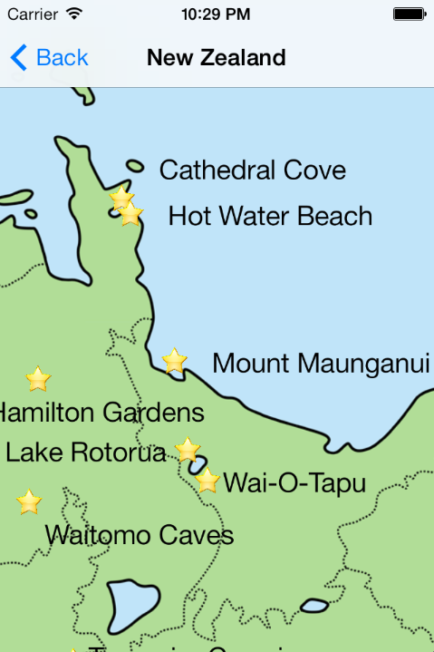
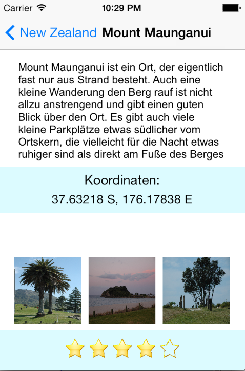

NZTravellerApp
==============

App for people travelling to New Zealand containing a map with points of Interest, including a description of the POI, a rating, some photos and the coordingates. The app is in German at the moment, because it is intenden for my parents.

I started with the [How To Use UIScrollView to Scroll and Zoom Content](http://www.raywenderlich.com/10518/) tutorial by Ray Wenderlich to create a zoomable map, which can be accessed by clicking on "Maps and Points of Interest".

On the map are shown stars in some locations that are worth visiting, clicking these leads to a description of the location, stars for rating, coordinates and a preview of the photos, which can be clicked to enlarge to picture. 

Screenshots:

 

 

App is functional, although there still are several bugs.

Things to fix:

- positioning when rotating iPhone/iPad to landscape orientation

- rescale buttons during zoom, differently than zoom/rescale level of map, so that buttons are visible when map zoomed out, but get a lot smaller when zoomed in

- when going from POI info back to map, map is at differenz position and zoom level
