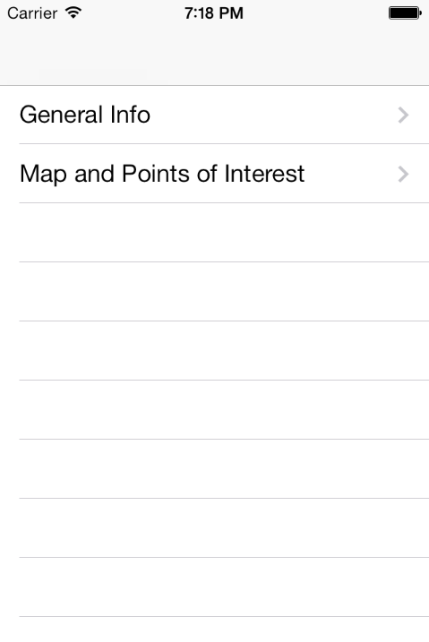
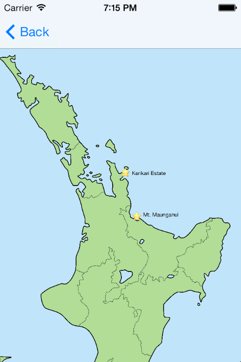
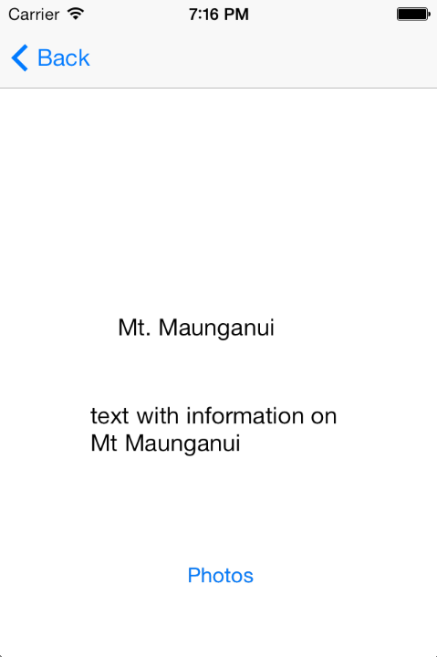
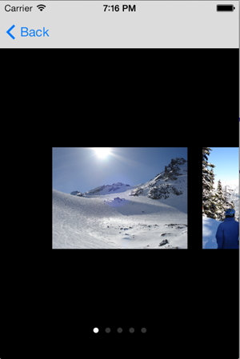

NZTravellerApp
==============

App for people travelling to New Zealand containing a map with points of Interest, including a description of the POI and some photos

I started with the [How To Use UIScrollView to Scroll and Zoom Content](http://www.raywenderlich.com/10518/) tutorial by Ray Wenderlich to create a zoomable map, which can be accessed by clicking on "Maps and Points of Interest".

On the map are shown stars in some locations that are worth visiting, clicking these leads to a description of the location and a "Photo" button, which leads to photos of the place.

So far I have added only two locations, as the method of doing so seems very unelegant with a lot of unnessecary code.
For example, using my approach, I would have to add a new view Controller in the main.storyboard for each location. Also, I would have to do the same with the PeekPagedScrollViewController, which contains the (dummy) image gallery so far.

Any help is appreciated.

Screenshots:

 

 

Things to fix:
- initial position of map (and also pictures in gallery) too low, even though "centerScrollViewContents" should automatically position image in middle.

- rescale buttons during zoom, differently than zoom/rescale level of map, so that buttons are visible when map zoomed out, but are small enough when zoomed in.
